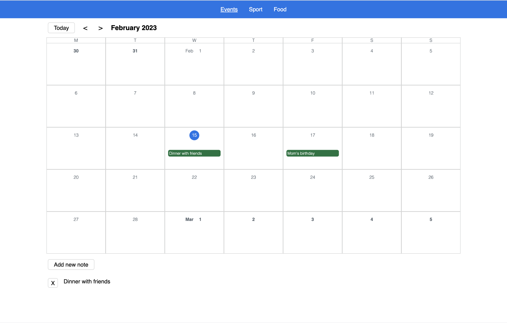
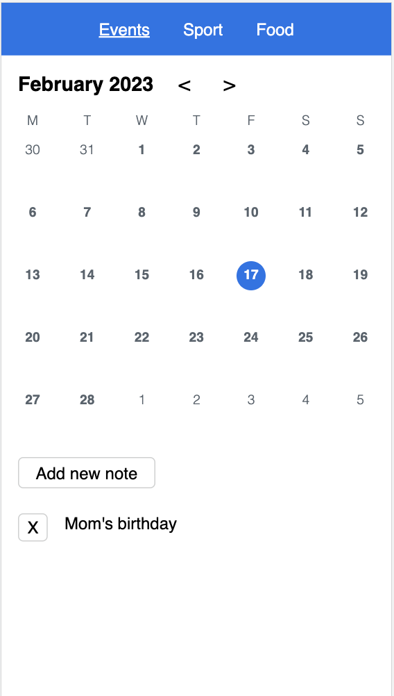

# Calendar Challenge

### The challenge

Users should be able to:

- View the optimal layout for the interface depending on their device's screen size (mobile vs desktop)
- Add and delete notes for each day
- See 3 different calendars: Events, Sport, Food (different notes)
- Jump to today

### Screenshot

## My work (1440px)

## My work (375px)

### Links

- Live Site URL: [(http://ajanickaite.lt/calendar-project-angular/)]

## My process

### Built with

- Angular
- CSS custom properties
- Flexbox
- no external libraries

### What I learned

- My first experience with Angular.
